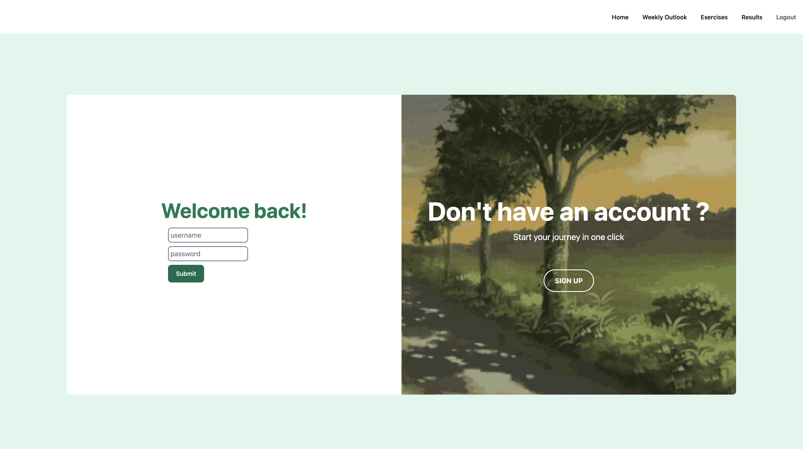

# workout-diet-tracker

# Description

This web application is designed to help users track their workouts and diets. Users can input data on what they ate, how long they exercised, and other activities to help them monitor their progress. The app includes a user-friendly dashboard that displays information in an easy-to-read format, allowing users to see their progress over time.

## Screenshots of App

### Login Page



### Create entry and quote api


### Weekly outlook


### Exercises api


### Results page


## Technologies

This project uses the following technologies:

- HTML, CSS, Javascript
- TailwindCSS: a utility-first CSS framework
- Flowbite: open source collection of UI components built with the utility classes from Tailwind CSS
- **M**ongoDB: a NoSQL database used to store and retrieve data
- **E**xpress: a backend web framework for Node.js
- **R**eact: a frontend JavaScript library for building user interfaces
- **N**ode.js: a JavaScript runtime environment for server-side development

## Installation

To install the application, follow these steps:

1. Clone the repository to your local machine.
2. Navigate to the root directory of the project.
3. Run npm install to install the necessary dependencies.
4. Run npm run dev to start the application.
5. Run two terminals client directory and server directory

## Usage

Once the application is running, you can navigate to http://localhost:5173 in your web browser to access the application. From there, you can create an account and start tracking your workouts and diets.

## Frontend Approach

### Design and functionality of the application

- **Interactive animations**: Animations for tabs, accordions, carousels and buttons that respond to user clicking
- **Functionality**: Start off with simple logging of workout and diet, calculate the difference in weight, bodyfat and muscles mass at the end of 12 weeks. Added some external APIs such as quotes and exercises to aid user in their logging.

### FrontEnd (React)

We use React to store states and user input to fetch data from a database:

1. Set up states to store user input or state change events.
2. Create functions to handle user input or state change events.
3. Use the stored states as body or params to fetch data from a database.
4. Set up states to store the fetched data.
5. Update the UI based on the fetched data.

### Reading retrieved binary image from database

The binary data retrieved from the database needs to be read in order to display the images correctly in the browser.

1. For the components that will be rendering the images retrieved, we need to import `Buffer` which helps in the handling and operations of binary data.

2. In the fetch function, we keep the results headers to be `"Content-Type": "application/json"`. This data is then stored into a state. The image object will later be manipulated.

3. We will initialize the buffer with the data by calling `Buffer.from()` and we read the data from the buffer with `toString("base64")`, specifying that it is of Base64 encoding. The returned string is stored into a variable.

```javascript
const base64string = Buffer.from(obj.img.data.data).toString("base64");
```

4. We then finally pass this variable to our `img` tag as it's `src` property to be rendered. Here, it is specified that the image is of Base64 encoding, and the string is passed.

### BackEnd

## JWT authentication middleware to protect admin endpoints

1. Created two separate auth middleware, (auth & authAdmin)
2. JWT Authentication added to the CRUD routes to protect different endpoints
3. User with role Admin will have extra access such as to view users and also delete the users
4. User with basic user role will only have access to CRUD entries

## Challenges

- **Data inconsistency**: Maintaining data consistency between the front-end and back-end required careful attention to detail. When the front-end and back-end had different data structures, keys or validation, inconsistencies occurred, which led to bugs and other issues.

- **Testing**: Testing the integration between the front-end and back-end was complex and time-consuming. Often, things did not display as expected when testing the HTTP requests.

- **Planning and execution**: Schema models and certain components and props have to be changed along the way as I realised there were
  more things to add or adjust. Better planning can be made for future projects.

## Unsolved Problems & Further Work

- Update entries model to include user and user's id to retrieve only entries specific to a certain user

- Optimise the use of react router dom and include nesting of routes to improve the layout of pages

- Include a refresh controller and route for the jwt token

- Add on more features to the website such as a nutritional breakdown of the food and possibly a workout program creator for
  users who may not know how to program a workout for themselves

- Add on a feature for a separate user like a trainer to view their client's logs and review them.

## Contributing

If you would like to contribute to this project, please follow these steps:

Fork the repository.
Create a new branch with your changes: git checkout -b my-feature-branch
Make your changes and commit them: git commit -m "my changes"
Push your changes to your fork: git push origin my-feature-branch
Submit a pull request.

## Contact

If you have any questions or concerns about this project, you can contact me at [mfirdausbn@gmail.com].
